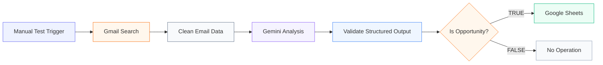
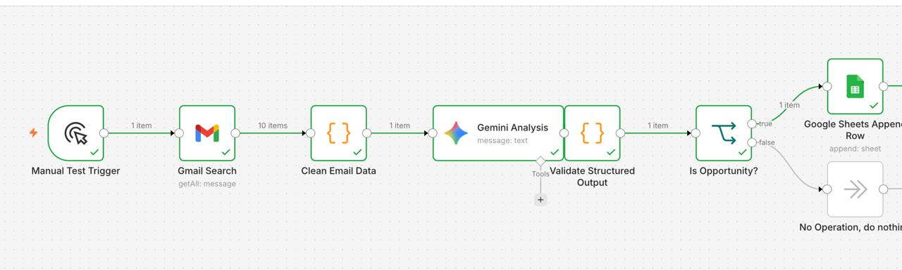
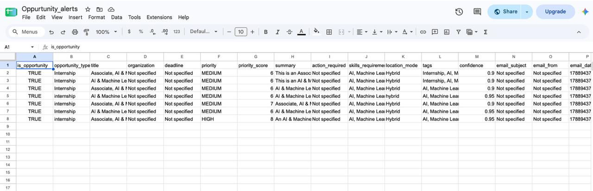

# Career Agent AI

> **Agentic AI-powered intelligence and automation platform for discovering, evaluating, and organizing career opportunities to get their dream jobs.**


---

## Overview

**Career Agent AI** transforms unstructured opportunity-related emails into structured career intelligence.

The current workflow follows:

```text
Email Discovery
        ↓
Data Cleaning
        ↓
Gemini Analysis
        ↓
Structured Validation
        ↓
Opportunity Decision
        ↓
Google Sheets
```

Instead of manually reviewing every incoming email, the pipeline identifies potential opportunities, extracts useful information, evaluates the result, and stores qualifying records in a structured format.

---

# The Problem

Career opportunities often arrive through ordinary emails such as:

- Internships
- Job opportunities
- Recruitment announcements
- Application notices
- Professional programs
- Other career-related opportunities

The challenge is that important information is usually scattered throughout the email.

A single message may contain:

| Information | Purpose |
|---|---|
| Opportunity Type | Internship, job, program, etc. |
| Title | Role or opportunity name |
| Organization | Company / institution |
| Deadline | Application deadline |
| Priority | Importance level |
| Required Skills | Skills associated with the opportunity |
| Location Mode | Remote / Hybrid / On-site |
| Action Required | What the user needs to do |
| Tags | Useful classifications |

### The core problem

> **How can unstructured opportunity emails be converted into consistent, useful, and reviewable career intelligence?**

---

# The Solution

Career Agent AI separates the process into dedicated stages:

```text
┌──────────────────────┐
│    DISCOVER          │
│   Find opportunity   │
│   emails             │
└──────────┬───────────┘
           ↓
┌──────────────────────┐
│    CLEAN             │
│   Prepare useful     │
│   email content      │
└──────────┬───────────┘
           ↓
┌──────────────────────┐
│    ANALYZE           │
│   Gemini extracts    │
│   opportunity data   │
└──────────┬───────────┘
           ↓
┌──────────────────────┐
│    VALIDATE          │
│   Check structured   │
│   AI output          │
└──────────┬───────────┘
           ↓
┌──────────────────────┐
│    CLASSIFY          │
│   Is it an actual    │
│   opportunity?       │
└──────────┬───────────┘
           ↓
┌──────────────────────┐
│    STORE             │
│   Save qualifying    │
│   opportunities      │
└──────────────────────┘
```

---

# System Architecture



### Architecture at a glance

| Stage | Responsibility |
|---|---|
| Manual Test Trigger | Starts a workflow execution |
| Gmail Search | Retrieves email messages |
| Clean Email Data | Prepares usable email content |
| Gemini Analysis | Interprets the email and extracts structured information |
| Validate Structured Output | Checks the generated result |
| Is Opportunity? | Determines whether the email qualifies |
| Google Sheets | Stores qualifying opportunity records |
| No Operation | Ends processing for non-opportunity messages |

---

# Real Workflow

The following is the **actual workflow screenshot from the project**.



### Processing path

```text
Manual Test Trigger
        ↓
Gmail Search
        ↓
Clean Email Data
        ↓
Gemini Analysis
        ↓
Validate Structured Output
        ↓
Is Opportunity?
      ↙       ↘
   TRUE       FALSE
    ↓           ↓
Google Sheets  No Operation
```

The workflow demonstrates the complete current processing path from email retrieval to structured opportunity storage.

---

# Structured Opportunity Output

Qualifying opportunity records are written to the `Opportunity_alerts` Google Sheet.



The current output includes fields such as:

| Field | Purpose |
|---|---|
| `is_opportunity` | Indicates whether the email represents an opportunity |
| `opportunity_type` | Classification of the opportunity |
| `title` | Opportunity title or role |
| `organization` | Organization associated with the opportunity |
| `deadline` | Available deadline information |
| `priority` | Assigned priority level |
| `priority_score` | Numerical priority score |
| `summary` | Short description |
| `action_required` | Action identified from the email |
| `skills_required` | Skills associated with the opportunity |
| `location_mode` | Location / work mode |
| `tags` | Relevant classification tags |
| `confidence` | AI confidence information |
| `email_subject` | Original email subject |
| `email_from` | Email sender |
| `email_date` | Email date information |

---

#  Key Capabilities

- Email-based opportunity discovery
- Email content preparation
- AI-assisted opportunity extraction
- Structured field extraction
- Opportunity / non-opportunity classification
- Priority generation
- Priority scoring
- Required-skill extraction
- Location-mode extraction
- Opportunity tagging
- Confidence information
- Google Sheets storage
- Preservation of original email metadata

---

# How the Intelligence Works

Consider an email containing an AI internship announcement.

### Before

```text
Subject:
Internship Opportunity - AI / Machine Learning

Body:
We are inviting applications for...
Required skills include...
Applications close...
Work mode...
```

### After

```text
┌────────────────────────────────────┐
│       STRUCTURED OPPORTUNITY       │
├────────────────────────────────────┤
│ Type:          Internship          │
│ Title:         AI / ML             │
│ Organization:  Extracted           │
│ Deadline:      Extracted           │
│ Priority:      HIGH / MEDIUM / LOW │
│ Priority Score: Generated          │
│ Skills:        AI, ML, ...         │
│ Location:      Remote / Hybrid     │
│ Action:        Apply / Register    │
│ Tags:          AI, ML, Internship  │
│ Confidence:    AI confidence       │
└────────────────────────────────────┘
```

The exact values depend on the source email.

---

# Technology Stack

| Technology | Role |
|---|---|
| **n8n** | Workflow orchestration and automation |
| **Gmail** | Source of opportunity emails |
| **Gemini** | AI analysis and structured extraction |
| **Google Sheets** | Storage for qualifying opportunities |
| **JSON / Structured Data** | Representation of analyzed opportunity records |

---

# Repository Structure

```text
career-agent-ai/
│
├── README.md
│
├── Workflow.jpeg
├── outputs.jpeg
│
├── ai-opportunity-email-triage/
│   └── ...
│
└── ...
```

> The repository structure shown above reflects the current GitHub layout. Add additional folders such as `workflows/`, `docs/`, or `sample-data/` only when those files are actually part of the project.

---

# Getting Started

## Prerequisites

You need:

- An n8n instance
- A Gmail account containing the emails to analyze
- Gemini access/configuration
- A Google Sheets document for storing results
- The workflow configuration used by the project

## Setup

### 1. Clone the repository

```bash
git clone https://github.com/ganeshkunche1/Career-Agent-AI.git
cd Career-Agent-AI
```

### 2. Open n8n

Open your local or hosted n8n instance.

### 3. Import the workflow

Import the workflow configuration used by the project.

### 4. Configure credentials

Connect the required:

- Gmail credentials
- Gemini credentials
- Google Sheets credentials

### 5. Configure the output

Use the `Opportunity_alerts` Google Sheet as the structured opportunity destination.

### 6. Execute the workflow

Run the manual test trigger and review the generated opportunity records.

---

# Security

Never commit secrets to GitHub.

Do **not** commit:

```text
API keys
Access tokens
Passwords
OAuth secrets
Private credentials
.env files containing secrets
```

Use n8n credentials and secure environment configuration instead.

---

# Engineering Design

The architecture intentionally separates:

```text
RAW DATA
   ↓
DATA PREPARATION
   ↓
AI INTERPRETATION
   ↓
STRUCTURED VALIDATION
   ↓
OPPORTUNITY CLASSIFICATION
   ↓
PERSISTENT STORAGE
```

This separation creates clear engineering boundaries.

### Why this matters

**Retrieval**  
Find the email data that needs to be processed.

**Cleaning**  
Prepare the email content for analysis.

**AI Analysis**  
Interpret the content and extract meaningful opportunity attributes.

**Validation**  
Provide a structured checkpoint between AI output and storage.

**Classification**  
Separate opportunity messages from unrelated messages.

**Storage**  
Persist qualifying records in a structured spreadsheet.

---

# Current Scope

The current implementation focuses on:

- Email retrieval
- Email cleaning
- AI-assisted opportunity analysis
- Structured output validation
- Opportunity classification
- Google Sheets storage

The current workflow is initiated through a manual test trigger.

---

# Limitations

- Extraction quality depends on the source email.
- Missing information may result in unavailable or unspecified fields.
- AI-generated classifications should be reviewed when accuracy is important.
- The current output destination is Google Sheets.
- The current workflow uses a manual test trigger.
- Future roadmap items are not presented as current capabilities.

---

# Roadmap

### Automated Email Monitoring

Move from manual execution toward scheduled or event-driven processing.

### Duplicate Detection

Prevent the same opportunity from being stored multiple times.

### Deadline Intelligence

Improve deadline normalization and surface time-sensitive opportunities.

### Advanced Opportunity Ranking

Improve ranking using additional opportunity and user-relevance criteria.

### Application Tracking

Connect discovered opportunities with application status.

### Notifications

Notify users when high-priority opportunities are detected.

### Career Agent Layer

Expand the pipeline toward a broader career-focused AI agent that helps users discover and act on relevant opportunities.

> These are proposed extensions and are not necessarily part of the current implementation.

---

# Project Screenshots

## 1. n8n Workflow


**The workflow view shows the automation architecture and the decision path used to identify qualifying opportunities.**

## 2. Structured Opportunity Output


**The output view demonstrates how analyzed opportunities are converted into structured records for review.**

---

# Engineering Summary

Career Agent AI demonstrates an applied AI automation pattern for converting unstructured career-related email information into structured opportunity intelligence.

```text
┌────────────┐
│  DISCOVER  │
└─────┬──────┘
      ↓
┌────────────┐
│    CLEAN   │
└─────┬──────┘
      ↓
┌────────────┐
│  ANALYZE   │
└─────┬──────┘
      ↓
┌────────────┐
│  VALIDATE  │
└─────┬──────┘
      ↓
┌────────────┐
│  CLASSIFY  │
└─────┬──────┘
      ↓
┌────────────┐
│   STORE    │
└────────────┘
```

The key engineering boundary is:

> **Unstructured Email → AI Interpretation → Structured Career Intelligence**

---

# Why Career Agent AI?

> **Opportunities are everywhere. The challenge is finding, understanding, prioritizing, and organizing the right ones.**

Career Agent AI turns that problem into an automated intelligence pipeline.

### From inbox noise → to structured career opportunities. 

---

## Project Information

| | |
|---|---|
| **Project** | Career Agent AI |
| **Automation Platform** | n8n |
| **Primary AI Component** | Gemini |
| **Email Source** | Gmail |
| **Output Store** | Google Sheets |
| **Output Sheet** | `Opportunity_alerts` |

---

## License

This project can be released under the **MIT License**.

---

### Career Agent AI 

**by GAnesH....**
