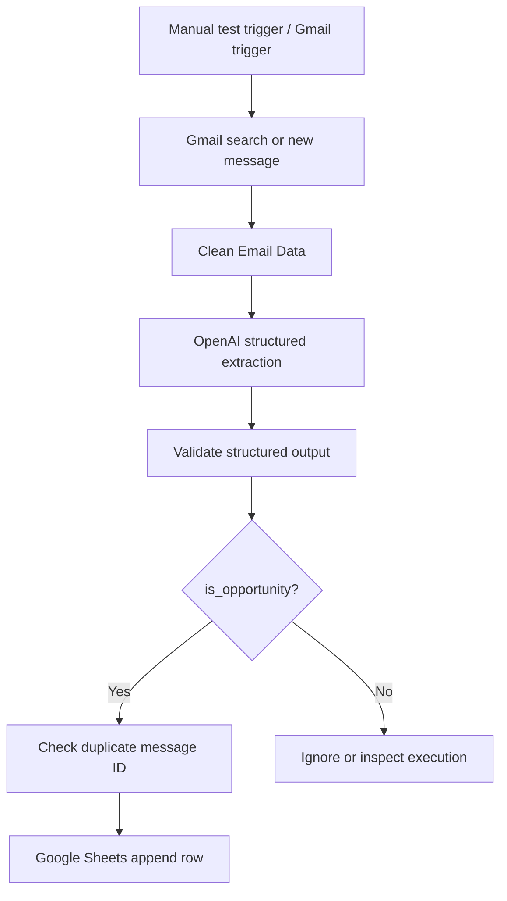

# Architecture

The included workflow implements the manual path: **Manual Trigger → Gmail Search → Clean Email Data → OpenAI Analysis → Validate Output → Opportunity? → Google Sheets Append Row**. Use executions to inspect non-opportunities. Before enabling a production Gmail Trigger, copy the processing nodes into that trigger path and test it with a controlled test message.

`Clean Email Data` limits AI input to normalized metadata and a clipped body. `Validate Structured Output` rejects malformed model output and normalizes arrays. The Google Sheet must use the header names documented in [configuration.md](configuration.md).
